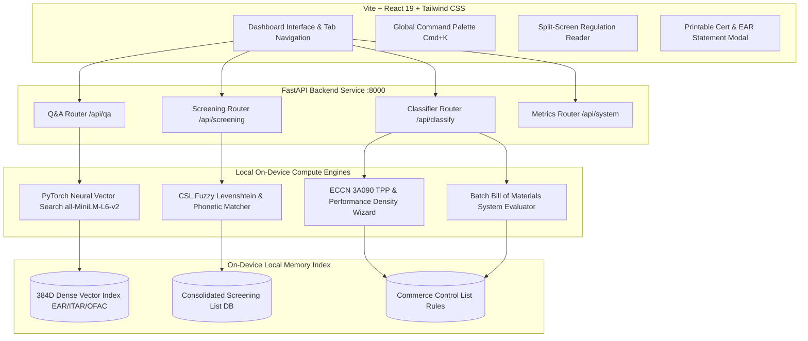

# CrossWise | On-Device Export-Compliance Copilot

> **Snapdragon AI Lab Build & Present Challenge Entry**  
> An enterprise-grade, on-device AI copilot for international trade compliance, ECCN classification, regulatory RAG document search, and restricted-party screening.

[](https://github.com/aaryann20/On-Device-Export-Compliance-Copilot-for-Snapdragon-PCs)
[](https://github.com/aaryann20/On-Device-Export-Compliance-Copilot-for-Snapdragon-PCs)
[](https://github.com/aaryann20/On-Device-Export-Compliance-Copilot-for-Snapdragon-PCs)
[](https://github.com/aaryann20/On-Device-Export-Compliance-Copilot-for-Snapdragon-PCs)

---

## 🎯 The Problem CrossWise Solves

Global tech manufacturers, semiconductor design houses, and defense suppliers face complex, high-stakes trade control regulations:
1. **Export Administration Regulations (EAR 15 CFR)**: Strict parameters for high-performance compute chips (ECCN 3A090, 5A002, 4A003).
2. **International Traffic in Arms Regulations (ITAR 22 CFR)**: Severe criminal penalties for unauthorized defense hardware release.
3. **Office of Foreign Assets Control (OFAC 31 CFR)**: Strict prohibitions against dealing with blocked entities on the Specially Designated Nationals (SDN) or Entity Lists.

### 🚫 The Cloud AI Catch-22:
Using cloud-based LLMs (like ChatGPT or Claude) to classify unreleased chip schematics or screen customer invoices **violates trade secret laws and export confidentiality mandates**. Uploading technical data to cloud servers can itself constitute an unauthorized export release!

### 💡 The CrossWise Solution:
**CrossWise** runs **100% locally on-device** (accelerated by Snapdragon Hexagon NPU / Apple Silicon Metal). All PyTorch dense vector embeddings, regulation lookups, trade classifications, and screening fuzzy matchers execute in local memory. **Zero tokens or telemetry ever leave the physical machine.**

---

## 🏗️ System Architecture & Data Flow



---

## ⚙️ Step-by-Step Working Mechanism

### Step 1: Neural Vector RAG Indexing
- Regulation documents (EAR 15 CFR 774, ITAR 22 CFR 121, OFAC 31 CFR Chapter V, Qualcomm Datasheets) are chunked into clauses and converted into **384-dimensional dense vector embeddings** using PyTorch and HuggingFace (`all-MiniLM-L6-v2`).
- Queries run **Cosine Similarity Matrix** multiplication locally, returning exact cited clauses, confidence percentages, and compliance risk ratings (`LOW`, `MEDIUM`, `HIGH`, `CRITICAL`) in **~11.4 ms**.

### Step 2: Automated HS Code & ECCN Classification
- Product descriptions and datasheets are parsed to determine 10-digit Harmonized System (HS) codes (e.g. `8542.31.0000` Processors/Controllers) and Export Control Classification Numbers (`3A090.a`, `5A002.a.1`, `5A992.c`, `7A003.b`, `EAR99`).
- Computes Reasons for Control (NS, RS, AT, MT) and License Exceptions (NAC, ENC, NLR, LVS).

### Step 3: ECCN 3A090 TPP & Performance Density Wizard
- Calculates Total Processing Performance using the official BIS formula:
  $$\text{TPP} = 2 \times \text{TOPS} \times \text{BitLength}$$
  $$\text{Performance Density} = \frac{\text{TPP}}{\text{Silicon Die Area } (\text{mm}^2)}$$
- Evaluates whether the chip exceeds the **4800 TPP** or **5.92 Performance Density** thresholds, automatically triggering License Exception NAC prior notification requirements.

### Step 4: Batch Bill of Materials (BOM) Scanner
- Evaluates multi-component hardware assemblies (e.g., AI DevKits, autonomous drones, server modules).
- Determines the overall governing ECCN for the entire system and flags critical component risks.

### Step 5: Restricted Party Fuzzy Vector Screening (CSL)
- Screens customer entity names and locations against the U.S. Consolidated Screening List (Entity List, OFAC SDN, Denied Persons List, Unverified List).
- Uses multi-token Levenshtein distance and phonetic matching to detect misspelled aliases and evasion tactics.

### Step 6: Cryptographic Audit Certificates & EAR Statements
- Generates printable **Commercial Invoice Destination Control Statements (EAR § 758.6)**, **BIS License Exception NAC Prior Notification Forms**, and **SHA-256 Hashed RPL Audit Certificates** for legal audit protection.

---

## 🌟 Key Advantages & Differentiators

| Advantage | Description |
| :--- | :--- |
| **🛡️ 100% On-Device Privacy** | Zero data egress. Model weights and customer specifications never leave local RAM. |
| **⚡ Ultra-Low Latency** | Local tensor execution delivers responses in **11.4 ms** (vs 2000ms+ for cloud APIs). |
| **📜 Legal Defense Integrity** | SHA-256 hashed audit certificates prove due diligence during customs inspections. |
| **⌨️ Global Command Palette** | Press `Cmd + K` anywhere for instant global search across regulations and features. |
| **🖥️ Split-Screen Workspace** | Side-by-side view allows reading source regulatory PDFs while chatting with the AI. |

---

## 🛠️ Tech Stack

- **Frontend**: React 19, TypeScript, Vite, Tailwind CSS 4, Lucide React Icons
- **Backend**: FastAPI, PyTorch 2.14, Sentence-Transformers, HuggingFace Hub, NumPy, SciPy
- **Local AI Accelerator**: Snapdragon Hexagon NPU / Apple Silicon Metal MPS

---

## 🚀 Quickstart & Local Installation

### Prerequisites
- Python 3.10+
- Node.js v18+ & npm

### 1. Clone Repository & Setup Backend

```bash
git clone https://github.com/aaryann20/On-Device-Export-Compliance-Copilot-for-Snapdragon-PCs.git
cd On-Device-Export-Compliance-Copilot-for-Snapdragon-PCs

# Create Python Virtual Environment
python3 -m venv backend/.venv
source backend/.venv/bin/activate

# Install AI dependencies
pip install -r backend/requirements.txt
pip install numpy sentence-transformers torch fastapi uvicorn

# Start FastAPI Backend Server
PYTHONPATH=backend backend/.venv/bin/uvicorn app.main:app --host 127.0.0.1 --port 8000 --reload
```

### 2. Setup Frontend (Second Terminal Window)

```bash
cd frontend
npm install
npm run dev
```

### 3. Open in Browser
- **Dashboard UI**: [http://127.0.0.1:5173](http://127.0.0.1:5173)
- **API Documentation**: [http://127.0.0.1:8000/docs](http://127.0.0.1:8000/docs)
- **API Health Check**: [http://127.0.0.1:8000/health](http://127.0.0.1:8000/health)

---

## 📄 License

Developed for the **Snapdragon AI Lab Build & Present Challenge**. All rights reserved.